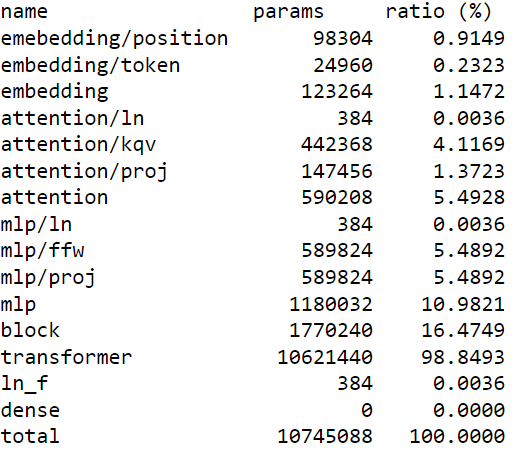

# Tranformer model using PyTorch
### Overview
This project presents a decoder-only transformer architecture trained on Shakespeare dataset. The goal was to develop a model capable of generating coherent and contextually relevant text in the style of William Shakespeare. The transformer, implemented from scratch, showcases my expertise in natural language processing and transformer architectures.

### Model and Training

This is a decoder-only architecture, similar to the GPT-2 model. The model includes attention layers with multiple attention heads, which can be configured from the config file in `trainer.py`. In the current version of the model, 6 layers and 6 attention heads are used. The embedding dimension used was 384, and the context length and batch size are set to 256 and 64, respectively. The learning rate used was 3e-4. The model was trained for 7000 steps and achieved a validation loss of 1.4.

Sample generation can be seen below. In this case, the model is trained on Shakespearean text using character-level encoding. A vocabulary size of 65 allowed me to train with a batch size of 64 on my single GPU with 6 GB of memory. The model has a size of 10 million parameters. Details of the model size by layer are given below.

#### Model size

The embedding dimension and vocabulary size determine the number of parameters in the embedding layer. Additionally, the memory required to store the logits in the final classification head is determined by the product of batch size, context length, and vocabulary size. For the above-mentioned configuration, the total model size in parameters is 10 million. A breakdown of each layer and block is provided below.

  

  

### Results
generated text sample from the model for the prompt "O God O God!"

