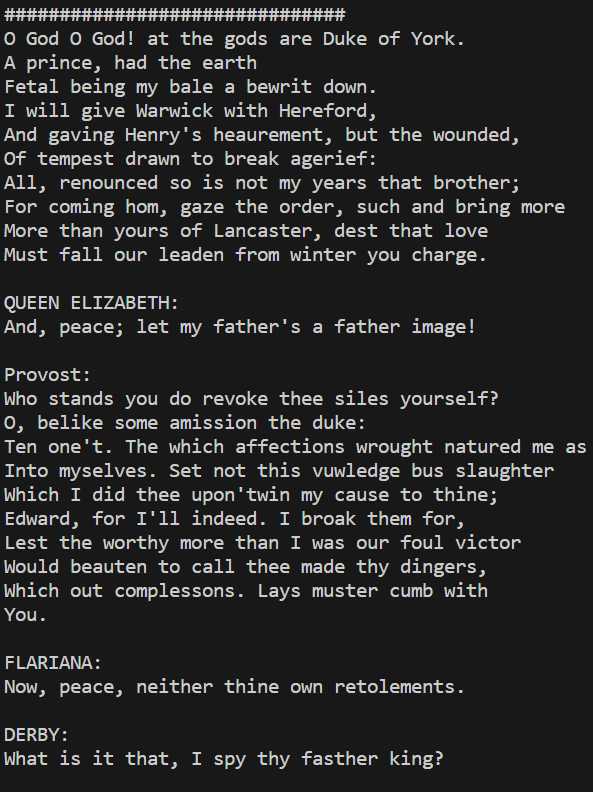

# Tranformer model using PyTorch
### Overview
This project presents a decoder-only transformer architecture trained on Shakespeare dataset. The goal was to develop a model capable of generating coherent and contextually relevant text in the style of William Shakespeare. The transformer, implemented from scratch, showcases my expertise in natural language processing and transformer architectures.

generated text sample from the model for the prompt "O God O God!"

